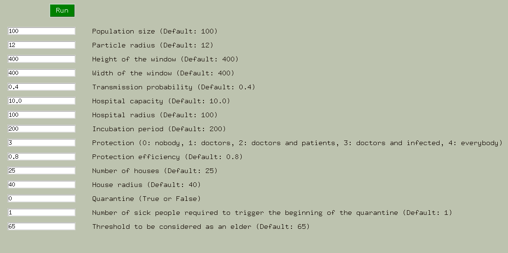
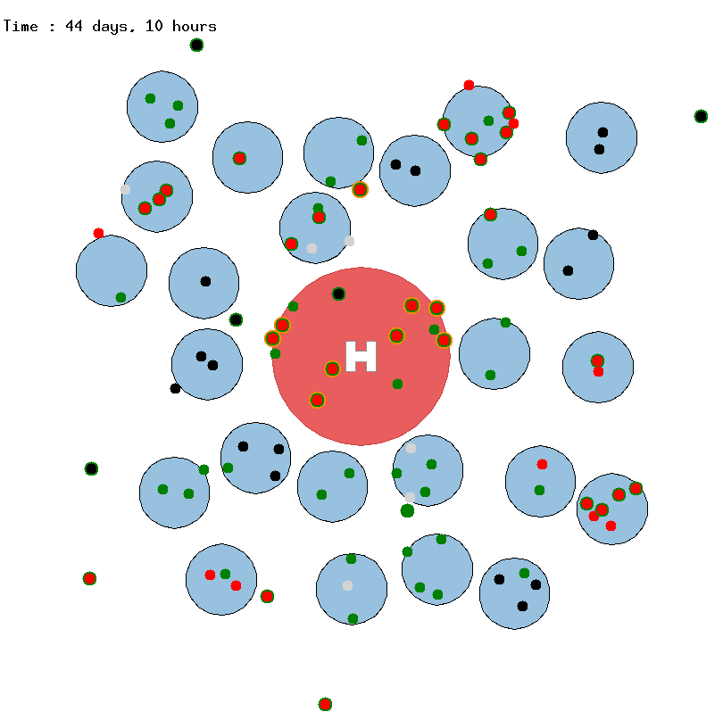
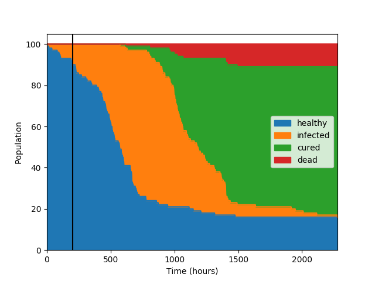
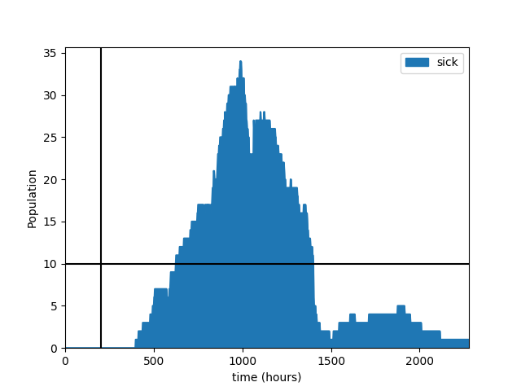

# Covid-19_hackaton &nbsp;&nbsp;&nbsp;&nbsp;&nbsp;&nbsp;&nbsp;&nbsp;&nbsp;&nbsp;&nbsp;&nbsp;&nbsp;&nbsp;&nbsp; [](https://chhendri.github.io/)


## Introduction

The Covid-19 disease represents one of the greatest challenges in public health in last months. The disease is spreading at an astonishing pace and we are not equipped to stop it's expansion.
This project was created in the frame of [CodeVsCovid-19](https://www.codevscovid19.org/), a Hackathon organised between the 27<sup>th</sup> and 30<sup>th</sup> of March 2020. The hackathon aims at providing innovative solutions against the coronavirus.

As master's students in bioinformatics and modeling, we decided to designe a simplified epidemiological model that simulates the outcome of the Covid19 outbreak under different conditions. This visualization of lockdown measures aims to help people understand its importance in order to slow down and control the spread of the virus.

## Features available

The model consists of a map with moving dots (people). We start with a healthy population and an infection carrier. When two dots collide, the disease can be transmitted. After a while, people show symptoms and go to hospital. Depending on their age, they have a certain probability of being cured or dying. If the hospital is full and they cannot be treated by doctors, they have a greater chance of dying. Older people have a higher priority than others in using the hospital.

We can choose parameters for the simulation such as:

* the number of sick people needed to trigger the lockdown;
* the probability of transmission;
* who wears protections (masks, gloves) that decrease the probability of transmission;
* the size of the dots which (the bigger they are, the smaller the social distance);
* and many more.

Part of the population is made up of doctors. Doctors can freely go to hospitals and visit people in their homes, even when the lockdown is active. They also have a higher protection priority.

## Workflow

In order to use this program, you will need Python3 and the following libraries:
* random (default library of python)
* math (default library of python)
* turtle
* pandas
* matplotlib
* tkinter

Those packages can be installed running the following command (if you already have python installed, directly go to the second command):
```
sudo apt install python3-tk
sudo apt-get install pandas tkinter
python3 -m pip install pip
python3 -m pip install matplotlib pandas
```

You can run the model by simply using the following command:
```
python3 main.py
```

This will first open a GUI displaying the different parameters of the model. They are filled in with default values but the interest of this model is the possibility to play with those parameters.

<p align="center">
  
</p>

After pressing the `RUN` button, the model starts to display dots which represent the movement of the population with houses (small circles) and a hospital (central circle with a H). The black dots represent healthy before having any contact with the virus. The red dots are infected people. They can either turn into white non-motile dots (dead) or green motile dots (cured). When there is a green border around the dot, it means that it is currently protected, while a yellow border means that it is using the hospital. Once in a hospital, a red dot cannot escape it unless it is a doctor or gets cured. If the hospital carrying capacity is reached, new red dots cannot enter it anymore.

<p align="center">
  
</p>

At the end of the simulation, the program outputs two different graphs.

The first one illustrates the evolution of the proportion of each health class (healthy, infected, cured, dead) throughout the modeled time. The vertical black line is the beginning of the lockdown.

<p align="center">
  
</p>

The second one shows the number of new infected cases through time. This one allows to detect the famous 'peak' often mentioned in the media. The vertical black line is the beginning of the lockdown and the horizontal one indicates the hospital capacity.

<p align="center">
  
</p>

Watch our video for a preview on the model:
<p align="center">
<a href="http://www.youtube.com/watch?feature=player_embedded&v=qzPgnL_uV3I
" target="_blank"></a>
</p>

## Files

* main.py --> model
* model_trad_V1/py --> initial model used to start our project. The original can be found [here](https://github.com/csamuelsm/covid19-simulations/blob/master/corona.pde)
* Planning.md --> to divide tasks more efficiently
* Information.md --> Useful links, General information, References


